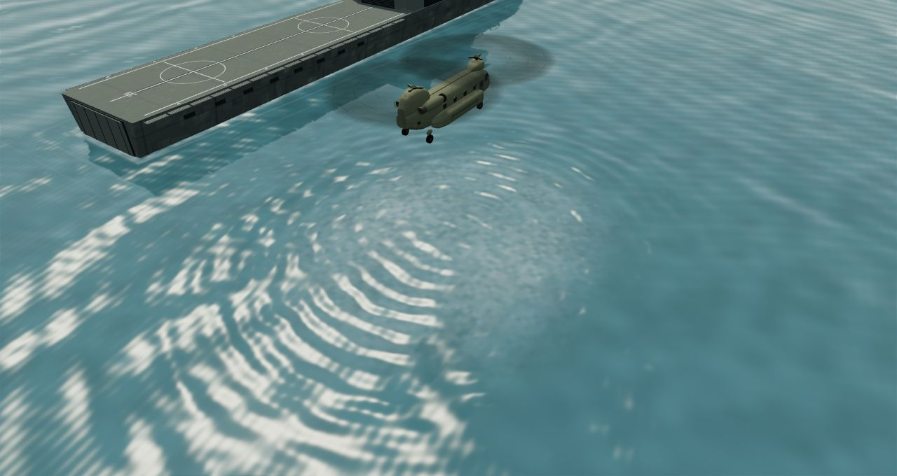
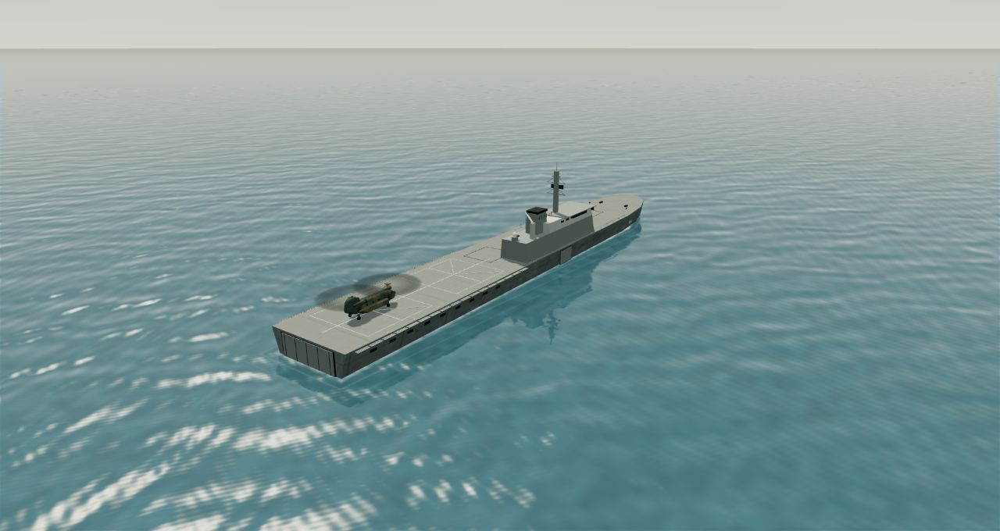
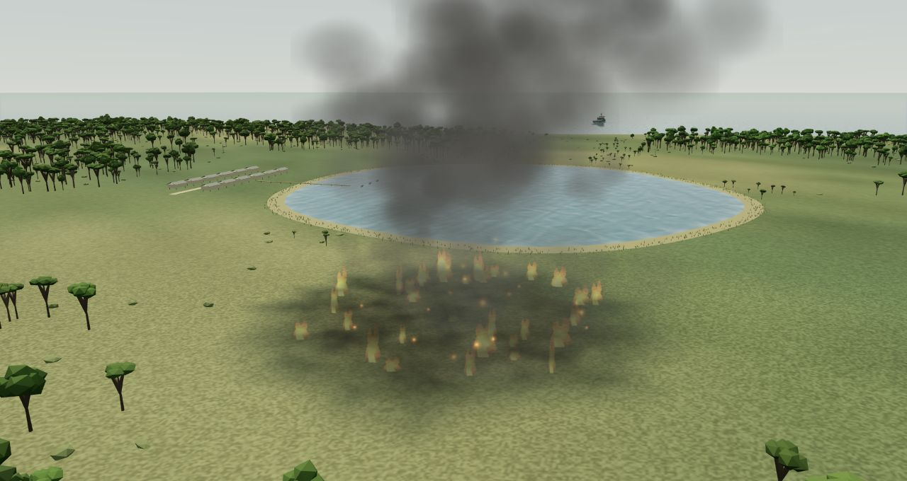

# Water, ships and atmosphere — 9 October 2026

Water now uses a 512 × 512 planar scene reflection for the active sea or lake, refreshed at most once per 80 ms, with continuous wave-normal animation between captures. Fresnel reflection, sun glints and wind-driven irregular wave bands replace the earlier solid surfaces. Subpixel waves fade to prevent distant shimmer. Sea and freshwater retain their existing collision and pickup elevations. Rivers use the same lighting without another reflection pass.

Twin downwash areas follow the rotor positions and fade with altitude; the ship deck intercepts downwash while the aircraft is on it. Bucket contact adds local lake ripples. Both ships remain stationary gameplay platforms, so their waterline disturbance is a restrained wave/foam band rather than a high-speed wake. Small lake boats bob subtly.

RSS Persistence and JS Kunisaki were refined against the ship-specific photographs and official drawings recorded in [ship references](ship-geometry-references.md). Their hull shoulders, bridge/island rake, glazing, fittings, paint variation and waterline were refined while preserving marked deck positions and clearance. Surface seams and weathering are authored visual approximations, not copied photographs or surveyed plates.

Fire now uses four instanced particle draws for flames, rising and low drifting smoke, embers, and steam as heat falls. Smaller flames and feathered, mottled burn scars keep the fire grounded. Wind carries the plume and cloud layers; entering the downwind plume adds gentle local haze, which clears as the fire is suppressed. The visible sun and directional light agree, and the shadow camera follows the aircraft.

## Visual checks

The images below are from temporary fixed camera views of the real rendering modules. Both normal campaign launch views were separately checked; the final production JGSDF scene had no new console warnings or errors. The 41 simulation/content tests and production build passed. Sustained physical-phone performance remains unmeasured.

